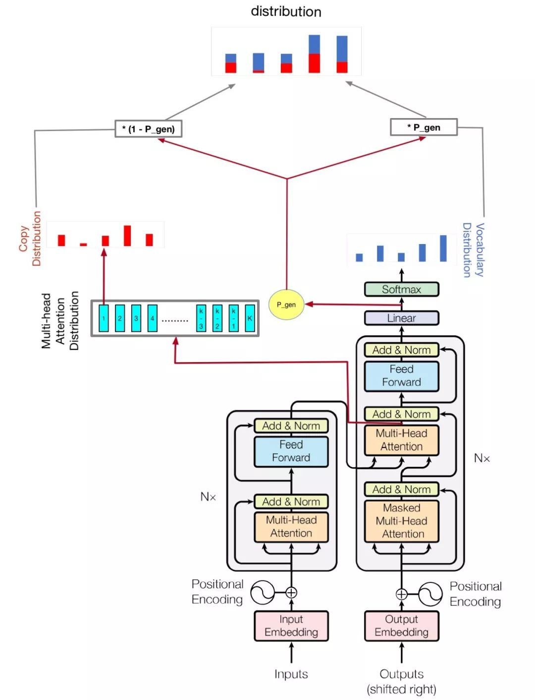

> Our code is modified based on [transformer-pointer-generator](https://github.com/xiongma/transformer-pointer-generator).
> The original project only supports datasets in Chinese format, and can not directly process Datasets in English format.


# A Abstractive Summarization Implementation with Transformer and Pointer-generator

when I wanted to get summary by neural network, I tried many ways to generate abstract summary, but the result was not good.
when I heared 2018 byte cup, I found some information about it, and the champion's solution attracted me, but I found some websites,
like github gitlab, I didn't find the official code, so I decided to implement it.


## Model Structure
### Based
My model is based on [Attention Is All You Need](https://arxiv.org/abs/1706.03762) and [Get To The Point: Summarization with Pointer-Generator Networks](https://arxiv.org/abs/1704.04368)
### Change
* The pointer-generator model has two mechanisms, which are **copy mechanism** and **coverage mechanism**, I found some materials, 
they show the Coverage mechanism doesn't suit short summary, so I didn't use this mechanism, just use the first one.
* Pointer generator model has a inadequacy, which can let the loss got nan, I tried some times and wanted to fix it,
but the result was I can't, I think the reason was when calculate final logists, it will 
 extend vocab length to oov and vocab length, it will get more zeroes. so I delete the mechanism of extend final logists, just use their mechanism of 
deocode from article and vocab. there is more [detail](https://github.com/abisee/pointer-generator/issues/4) about it, 
in this model, I just use word than vocab, this idea is from bert.
### Structure


## Requirements
* python==3.x (Let's move on to python 3 if you still use python 2)
* tensorflow==1.12.0
* tqdm>=4.28.1
* jieba>=0.3x
* sumeval>=0.2.0

## Preprocessing
* STEP 1. Create folder `dataset/your_dataset_name` and create `train_source.txt`, `train_target.txt`, `eval_source.txt`, `eval_target.txt`, `test_source.txt`, `test_target.txt`.  Noted that each file contains the corresponding text line by line.
* STEP 2. Run command `python merge_source_target.py` to get the processed files(`train.csv`, `eval.csv`, `test.csv` and `vocab`)


## Training

Run the following command.

```python
python train.py
```
Check `hparams.py` to see which parameters are possible. For example,
```python
python train.py --logdir log/conala --evaldir eval/conala --train dataset/conala/train.csv --eval dataset/conala/eval.csv --vocab dataset/conala/vocab --vocab_size 4137 --maxlen1 200 --maxlen2 50 --batch_size 32
```
My code also improve multi gpu to train this model, if you have more than one gpu, just run like this
```python
python train.py --logdir log/conala --evaldir eval/conala --train dataset/conala/train.csv --eval dataset/conala/eval.csv --vocab dataset/conala/vocab --vocab_size 4137 --maxlen1 200 --maxlen2 50 --batch_size 32 --gpu_nums=1
```

| name | type | detail |
|--------------------|------|-------------|
|vocab_size | int | vocab size|
|train | str | train dataset dir|
|eval | str| eval dataset dir|
|test | str| data for calculate rouge score|
|vocab | str| vocabulary file path|
|batch_size | int| train batch size|
|eval_batch_size | int| eval batch size|
|lr | float| learning rate|
|warmup_steps | int| warmup steps by learing rate|
|logdir | str| log directory|
|num_epochs | int| the number of train epoch|
|evaldir | str| evaluation dir|
|d_model | int| hidden dimension of encoder/decoder|
|d_ff | int| hidden dimension of feedforward layer|
|num_blocks | int| number of encoder/decoder blocks|
|num_heads | int| number of attention heads|
|maxlen1 | int| maximum length of a source sequence|
|maxlen2 | int| maximum length of a target sequence|
|dropout_rate | float| dropout rate|
|beam_size | int| beam size for decode|
|gpu_nums | int| gpu amount, which can allow how many gpu to train this model, default 1|

### Note
Don't change the hyper-parameters of transformer util you have good solution, it will let the loss can't go down! if you have good solution, I hope you can tell me.

## Evaluation

Run the following command:

```python
python pred.py --ckpt log/conala/trans_pointerE3468L0.37-3468 --test dataset/conala/test.csv --vocab dataset/conala/vocab --vocab_size 4137 --maxlen1 200 --maxlen2 50
```

Run command `python merge_source_target.py` to get the BLEU-4, ROUGE-L and METEOR scores.

## If you like it, and think it useful for you, hope you can star.